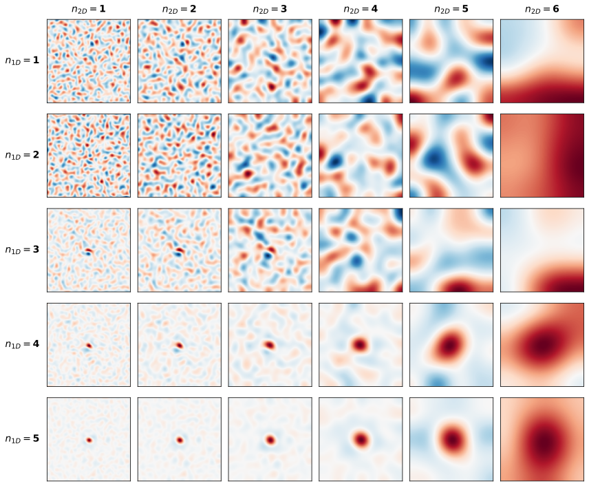
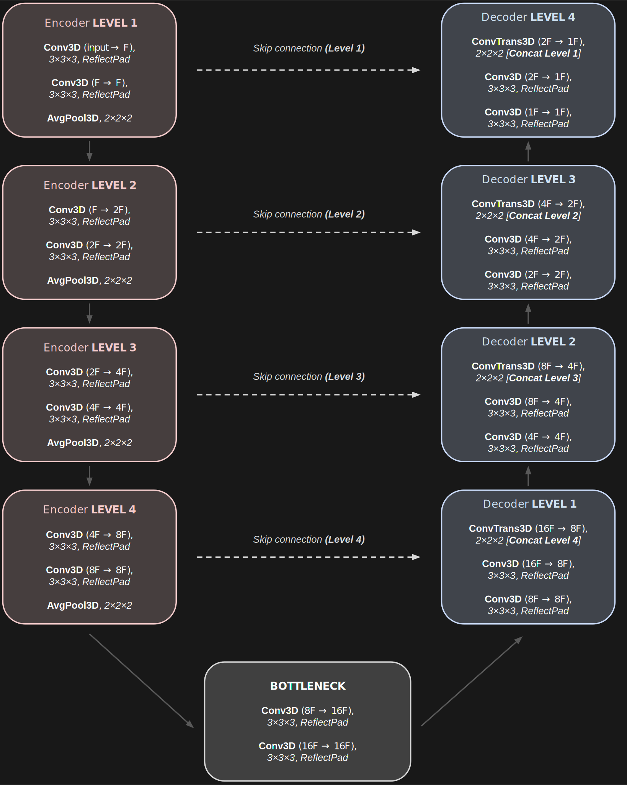
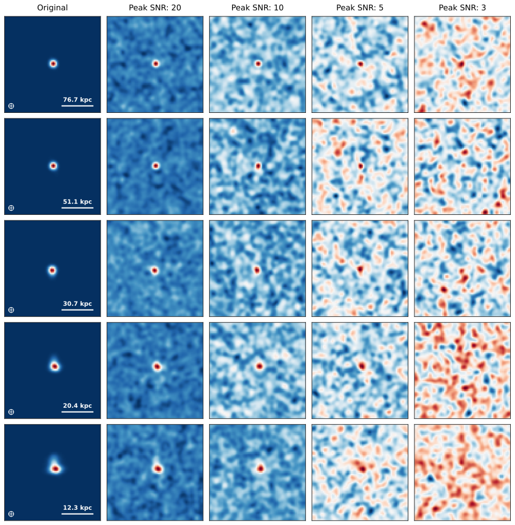

# Repository for denoising algorithms and benchmark analyses on synthetic, simulated, and observed high-redshift galaxy spectral cubes.

This repository provides the full codebase for a denoising framework integrating classical statistical methods, sparse representations, and supervised deep learning architectures. It is designed for reproducible benchmarking and comparative evaluation of spectral-cube denoising algorithms used in the analysis of high-redshift galaxy observations.

The implemented methods are optimized for preserving astrophysical flux and morphology while mitigating beam-correlated noise typical in interferometric data such as ALMA [C II] cubes.

---

## Overview

The repository contains modular Python scripts implementing:

- **Independent Component Analysis (ICA)** denoising  
- **Principal Component Analysis (PCA)** denoising  
- **Iterative 2D–1D wavelet soft thresholding**  
- **3D U-Net architecture for supervised denoising**  
- **Training pipeline for the 3D U-Net**  
- **Synthetic toy cube generator** producing thousands of variable mock spectral cubes  
- **Statistical comparison utilities** for toy cubes  
- **Denoising performance analysis tools** for real and simulated datasets (e.g., W2246, FIRE)

Complementary Jupyter notebooks provide visualization, moment-map generation, and comparative analysis of the denoising outputs across data domains.

---

## Methodological Summary

### PCA and ICA Denoising

PCA and ICA are implemented as unsupervised linear decomposition methods.  
Each spectral cube $Y(x, y, v)$ is reshaped into a two-dimensional matrix, with each row representing the spectrum of a spatial pixel.  

**PCA:**  
The cube is reconstructed using the dominant principal components that capture the majority of the signal variance. Reconstruction proceeds until the integrated flux within the emission aperture stabilizes. Only components preserving consistent flux are retained, effectively discarding noise-dominated subspaces.

**ICA:**  
ICA decomposes $Y' \approx AS$, where $A$ is the mixing matrix and $S$ the independent sources.  
The cube is reconstructed using a subset of statistically independent components that contribute most strongly to the total flux, minimizing residual correlated noise.

---

### 2D–1D Wavelet-Based Iterative Soft Thresholding

The iterative wavelet algorithm performs a separable transform:
$$
\alpha = \Phi^{T} X,
$$
where $\Phi^{T}$ represents a 2D isotropic Starlet transform applied spatially and a 1D biorthogonal B-spline transform applied spectrally.

The denoising minimizes:

$$J(X) = \|Y - X\|^2 + \lambda \|\Phi^T X\|_p, \quad p \in \{0, 1\},$$

where $p = 1$ corresponds to soft thresholding. Thresholds are derived from the median absolute deviation (MAD) of the wavelet coefficients:

$$\sigma_\alpha = \frac{\text{median}(|\alpha - \text{median}(\alpha)|)}{0.6745}.$$

Reweighted soft thresholding iteratively refines the wavelet coefficients to correct the bias of the ℓ₁ penalty:

$$W_i^{(n)} = \frac{\lambda \sigma_\alpha^{(n-1)}}{|\alpha_i^{(n-1)}| + \epsilon}.$$

Residual signal extraction is performed on the remaining flux, ensuring convergence when the residual variance plateaus.

The method conserves integrated flux while adaptively suppressing noise at multiple spatial and spectral scales.

---

### 3D U-Net Denoising

The supervised approach employs a fully three-dimensional convolutional neural network based on the U-Net architecture.  
The model is trained on a large set of synthetic spectral cubes of rotating disk galaxies generated by the toy cube constructor.

The U-Net consists of:
- Four encoder and decoder levels connected via skip connections  
- 3×3×3 convolutional layers with reflective padding  
- Average pooling for downsampling (preserving flux density)  
- LeakyReLU activations  
- Transposed convolutions for upsampling

The network is optimized using the Adam optimizer with learning rate $10^{-4}$ and mean squared error (MSE) loss:

$$\mathcal{L} = \frac{1}{N} \sum_i (X_i^{\text{true}} - X_i^{\text{pred}})^2.$$

Training data are partitioned into 80 % training, 10 % validation, and 10 % testing sets.  
The resulting weights and training logs are stored in the `weights` directory.

---

## Synthetic Dataset Construction

A large configurable dataset of mock spectral cubes is generated to simulate realistic interferometric observations.  
Each cube represents a system of rotating disk galaxies defined by parameters such as:
- Effective radius $R_e$ and Sérsic index $n$
- Vertical scale height $h_z$
- Inclination and rotation velocity fields
- Beam convolution kernel (Gaussian with given FWHM)
- Peak SNR between 2.5 and 8

The intrinsic 3D light distribution follows:

$$S(x, y, z) = S_e \exp\!\left[-b_n \left(\frac{\sqrt{x^2 + y^2}}{R_e}\right)^{1/n} + 1\right]\exp\!\left(-\frac{|z|}{h_z}\right),$$

and is expressed in units of Jy beam⁻¹ after convolution with a Gaussian beam and addition of spatially correlated noise.

These synthetic cubes form the core training and benchmarking dataset for both the unsupervised and supervised denoising pipelines.

---

## Performance Metrics

The repository includes implementations of flux- and error-based evaluation metrics used across all analyses.

1. **Flux Conservation**
   $$S = \sum_{(i,j,k)\in A} X_{i,j,k}$$
   where $A$ is the emission aperture.

2. **Root Mean Squared Error (RMSE)**
   $$\text{RMSE} = \sqrt{\frac{1}{N_p} \sum_{A} (X^{\text{den}} - X^{\text{true}})^2}$$

3. **Residual Standard Deviation and SNR Gain**  
   Quantify the magnitude of remaining noise and signal enhancement.

4. **Morphological Fidelity**  
   Derived from moment map and spectrum comparison.

All metrics can be applied consistently across synthetic, simulated, and real cubes to quantify denoising fidelity and flux recovery.

---

## Results Summary

- **PCA/ICA:** Effective at decorrelating linear noise components, but limited for spatially correlated noise and nonlinear signal mixing.  
- **2D–1D Wavelet (IST):** Robust flux preservation (≥ 95 %) and significant noise suppression at moderate SNR; conservative under very low SNR.  
- **3D U-Net:** Achieves the highest SNR gains and structural recovery, generalizing from synthetic training data to simulated and real cubes, including FIRE and W2246.  
- **Combined Use:** Sparse and deep methods are complementary—wavelet denoising ensures physical robustness, while the U-Net provides adaptive, data-driven noise removal.

---

## Dependencies

This repository uses Python ≥ 3.10 and relies on the following core packages:

- [NumPy](https://numpy.org/)
- [SciPy](https://www.scipy.org/)
- [Astropy](https://www.astropy.org/)
- [scikit-learn](https://scikit-learn.org/)
- [PyTorch](https://pytorch.org/)
- [Matplotlib](https://matplotlib.org/)
- [h5py](https://www.h5py.org/)
- [Sparse2D](https://github.com/CosmoStat/Sparse2D)
- [CosmoStat](https://github.com/CosmoStat/cosmostat)
- [SpectralCube](https://spectral-cube.readthedocs.io/en/latest/)

## Citation

If you use this repository, please cite:

Lahiry, A., Díaz-Santos, T., Starck, J.-L., Roy, N. C., Anglés-Alcázar, D., Tsagkatakis, G., & Tsakalides, P. (2025).  
*Deep and Sparse Denoising Benchmarks for Spectral Data Cubes of High-z Galaxies: From Simulations to ALMA Observations.*  
Submitted to Astronomy & Astrophysics, 2025.

